# hazelcast

- ### start the project
    ```
    docker-compose up -d
    ```
    check the containers
    ```
    docker ps -a
    ```
    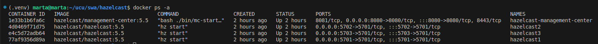

Observing the cluster in Management Center.
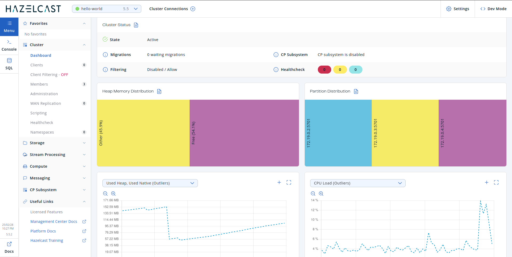

No Locks vs Pesimistic Lock vs Optimistic Lock

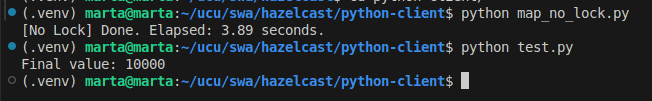
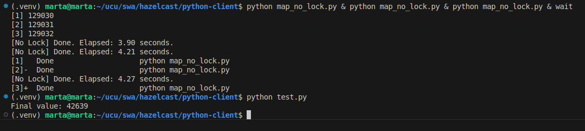
---
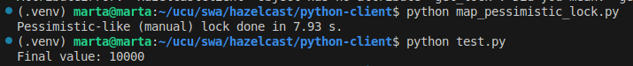
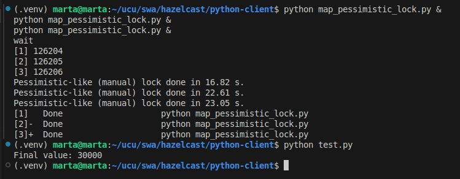
---
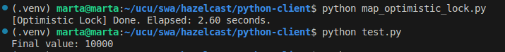
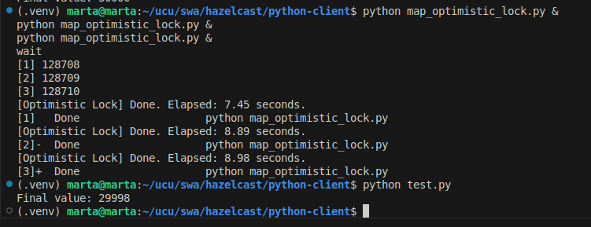

## Running the Queue
```
python queue_consumer.py ConsumerA
```
```
python queue_consumer.py ConsumerB
```
```
python queue_producer.py
```

### Result:

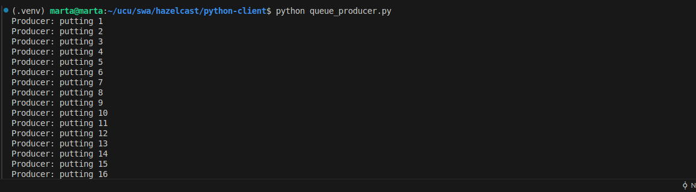
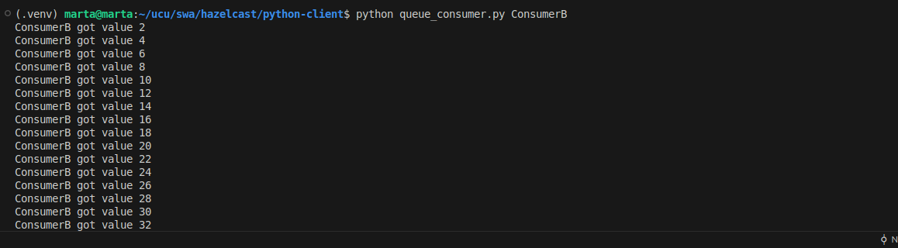
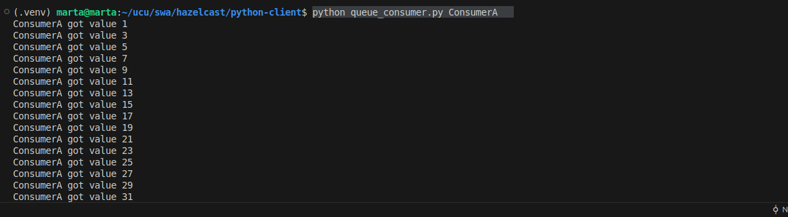

